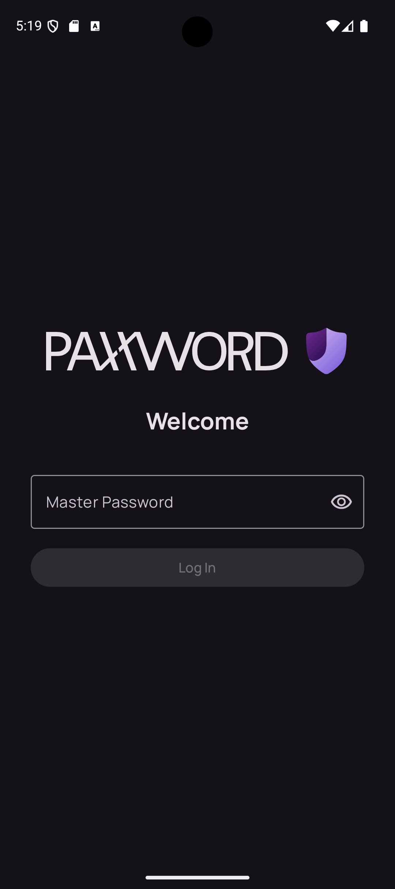
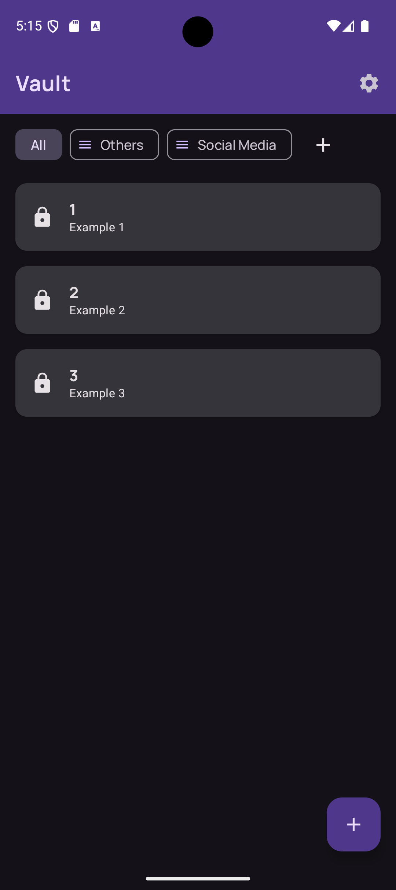
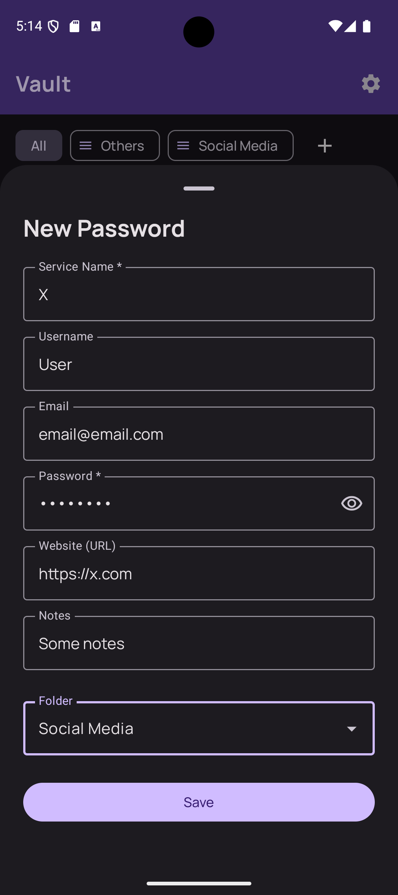
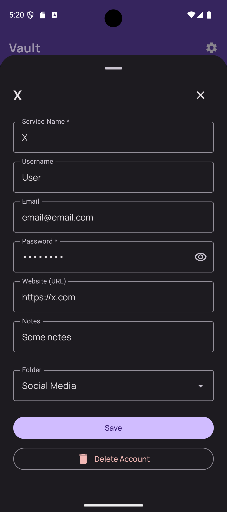
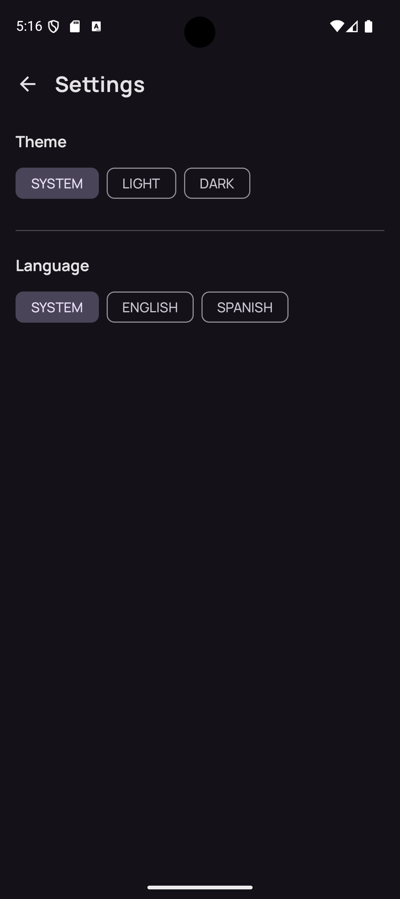
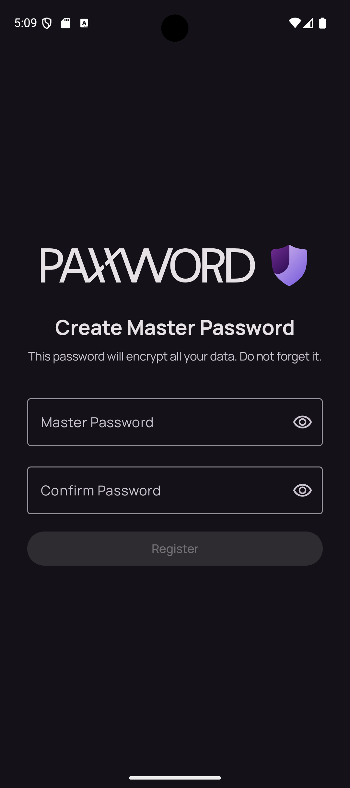
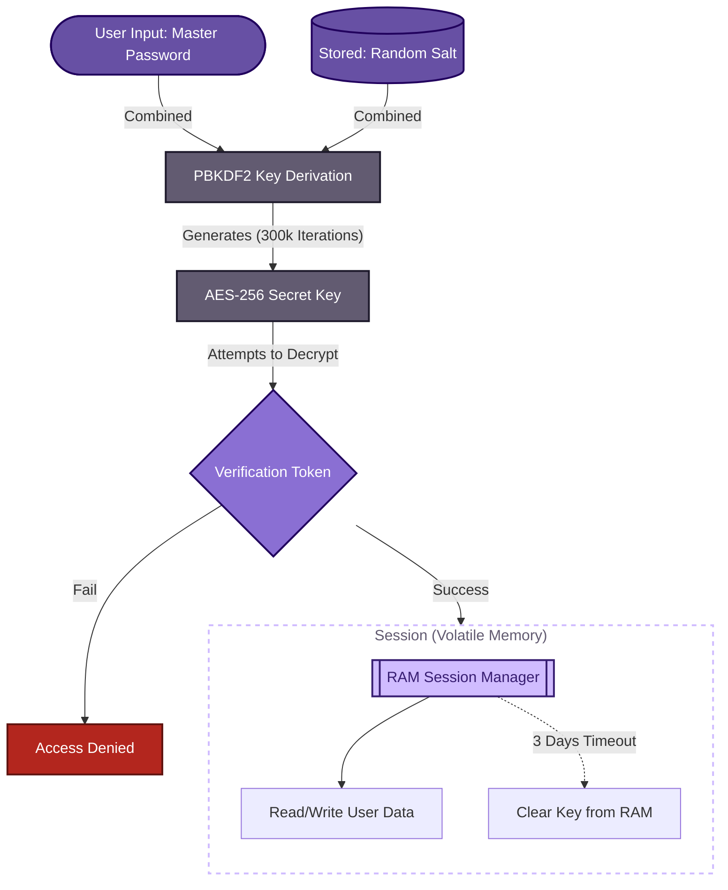

  <picture>
    <source media="(prefers-color-scheme: dark)" srcset="./docs/Icons/paxxword_name_white.svg">
    <source media="(prefers-color-scheme: light)" srcset="./docs/Icons/paxxword_name_black.svg">
    
  </picture>&emsp;

  Secure. Private. Offline. A zero-knowledge password manager built with Jetpack Compose.

  
  
  

## Application Overview

**Paxxword** is a modern Android application designed to secure sensitive credentials using military-grade encryption standards. Unlike cloud-based managers, Paxxword operates entirely **offline**, ensuring that your master password and data never leave your device.

It is engineered with a strict **Clean Architecture** approach, utilizing **MVVM** and modern Android Jetpack libraries to deliver a robust, scalable, and secure experience.

<table>
  <tr>
    <td align="center"><b>Login / Auth</b></td>
    <td align="center"><b>Vault Home</b></td>
    <td align="center"><b>Account Details</b></td>
  </tr>
  <tr>
    <td width="33%">
      <picture>
        <source media="(prefers-color-scheme: dark)" srcset="./docs/screenshots/login_screen.png">
        <source media="(prefers-color-scheme: light)" srcset="./docs/screenshots/login_screen_white.png">
        
      </picture>
    </td>
    <td width="33%">
      <picture>
        <source media="(prefers-color-scheme: dark)" srcset="./docs/screenshots/vault_home.png">
        <source media="(prefers-color-scheme: light)" srcset="./docs/screenshots/vault_home_white.png">
        
      </picture>
    </td>
    <td width="33%">
      <picture>
        <source media="(prefers-color-scheme: dark)" srcset="./docs/screenshots/account_detail.png">
        <source media="(prefers-color-scheme: light)" srcset="./docs/screenshots/account_detail_white.png">
        
      </picture>
    </td>
  </tr>
  <tr>
    <td align="center"><b>Edit Mode</b></td>
    <td align="center"><b>Settings</b></td>
    <td align="center"><b>Signup</b></td>
  </tr>
  <tr>
    <td width="33%">
      <picture>
        <source media="(prefers-color-scheme: dark)" srcset="./docs/screenshots/account_detail_edit.png">
        <source media="(prefers-color-scheme: light)" srcset="./docs/screenshots/account_detail_edit_white.png">
        
      </picture>
    </td>
    <td width="33%">
      <picture>
        <source media="(prefers-color-scheme: dark)" srcset="./docs/screenshots/settings.png">
        <source media="(prefers-color-scheme: light)" srcset="./docs/screenshots/settings_white.png">
        
      </picture>
    </td>
    <td width="33%">
      <picture>
        <source media="(prefers-color-scheme: dark)" srcset="./docs/screenshots/singup_screen.png">
        <source media="(prefers-color-scheme: light)" srcset="./docs/screenshots/singup_screen_white.png">
        
      </picture>
    </td>
  </tr>
</table>

## Security Architecture

Paxxword uses a **Zero-Knowledge** architecture. The application does not store your master password. Instead, it relies on on-the-fly key derivation.

### Encryption Flow

* **Algorithm:** AES/GCM/NoPadding (Galois/Counter Mode).
* **Key Derivation:** PBKDF2WithHmacSHA256 (300,000 iterations).
* **Storage:** Keys exist *only* in RAM. The database stores only the Salt and IVs.
* **Privacy:** `FLAG_SECURE` is enabled to prevent OS screenshots and "Recent Apps" previews.

## Tech Stack

This project is built using modern Android technologies:

| Category | Libraries / Tools |
| :--- | :--- |
| **Language** | Kotlin (v2.0+) |
| **UI** | Jetpack Compose (Material 3) |
| **Architecture** | MVVM + Clean Architecture |
| **Dependency Injection** | Dagger Hilt |
| **Database** | Room (SQLite) |
| **Async** | Coroutines & Flow |
| **Storage** | Jetpack DataStore (Preferences) |
| **Navigation** | Navigation Compose |

## Project Structure

  
A breakdown of the Clean Architecture implementation:

    com.rubenalba.paxxword  # MainActivity, PaxxwordApp
    ├── data
    │   ├── local           # AppDatabase
    │   │   ├── dao         # AccountDao, FolderDao, UserDao
    │   │   └── entity      # Account, Folder, User
    │   ├── manager         # CryptoManager, KeyDerivationUtil, LocaleManager, SessionManager
    │   └── repository      # PasswordRepositoryImpl, UserPreferencesRepository
    ├── di                  # AppModule, RepositoryModule
    ├── domain
    │   ├── model           # AccountModel, RepositoryModule
    │   └── repository      # PasswordRepository
    └── ui
        ├── auth            # AuthScreen, AuthViewModel
        ├── navigation      # AppNavigation
        ├── settings        # SettingsScreen, SettingsViewModel
        ├── splash          # SplashViewModel
        ├── theme           # Color, Theme, Type
        └── vault           # VaultScreen, VaultViewModel
            └── components  # AccountDetailSheet, AccountItem, FolderComponents

## Key Features

* **Secure Vault:** Store passwords, emails, URLs, and secure notes.
* **Smart Organization:** Organize accounts into custom folders with cascading deletion support.
* **Reactive Filtering:** Filter credentials by folder instantly using `FlatMapLatest`.
* **Visual Privacy:** Sensitive fields (passwords) are masked and use monospaced fonts (`JetBrains Mono`) for readability.
* **Theming:** Full support for Light and Dark modes.
* **Localization:** Native support for 🇬🇧 English and 🇪🇸 Spanish.

---

## Contribution

Contributions are welcome! To maintain the project's stability and strict Clean Architecture standards, please follow this workflow:

1.  **Open an Issue First:** Before writing any code, please [open an issue](https://github.com/rubenalba/paxxword/issues) to discuss the proposed change or feature.
    * *This ensures your work aligns with the roadmap and architecture.*
2.  **Wait for Approval:** Once the issue is discussed and approved, assign it to yourself.
3.  **Fork the Repository.**
4.  **Create a Branch.**
5.  **Commit your Changes:** Follow clear commit messages.
6.  **Open a Pull Request:**
    * Reference the issue in your PR description (e.g., *"Closes #12"*).
    * Ensure all checks pass.

> **Note:** Pull Requests without an associated Issue may be closed without review.

---

> [!WARNING]
> **Important Disclaimer**
>
> **Paxxword is provided "as is", without warranty of any kind.**
>
> * **No Password Recovery:** Because this application uses a **Zero-Knowledge** architecture, **your Master Password is NOT stored anywhere** (neither on the device nor in the cloud). If you forget your Master Password, **your data will be permanently inaccessible**. There is no "forgot password" feature and no backdoor to recover it.
> * **Limitation of Liability:** The developer is not responsible for any data loss, forgotten passwords, or security breaches resulting from the use of this software. Use it at your own risk.

---

  Built with ☕ by Rubén Alba

